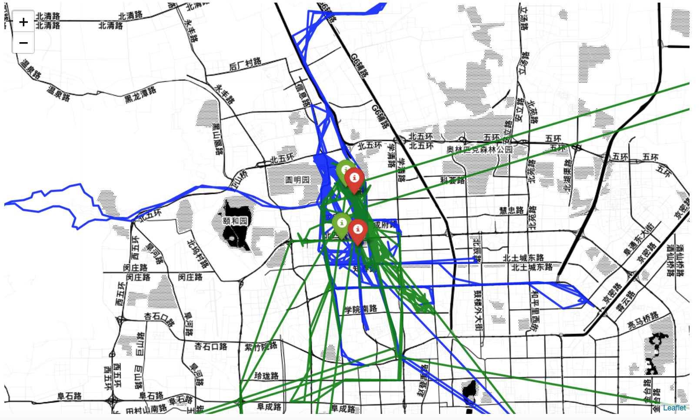
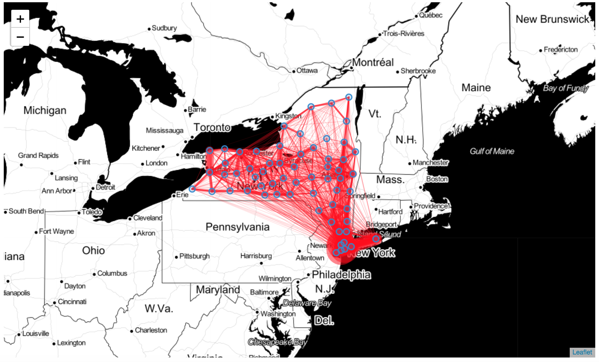
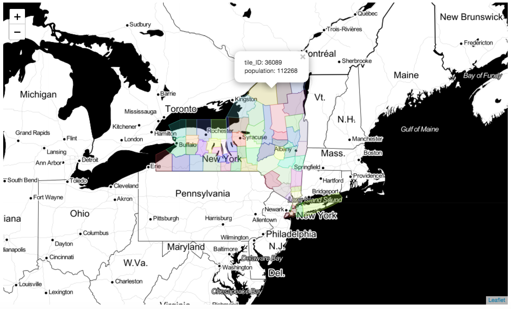
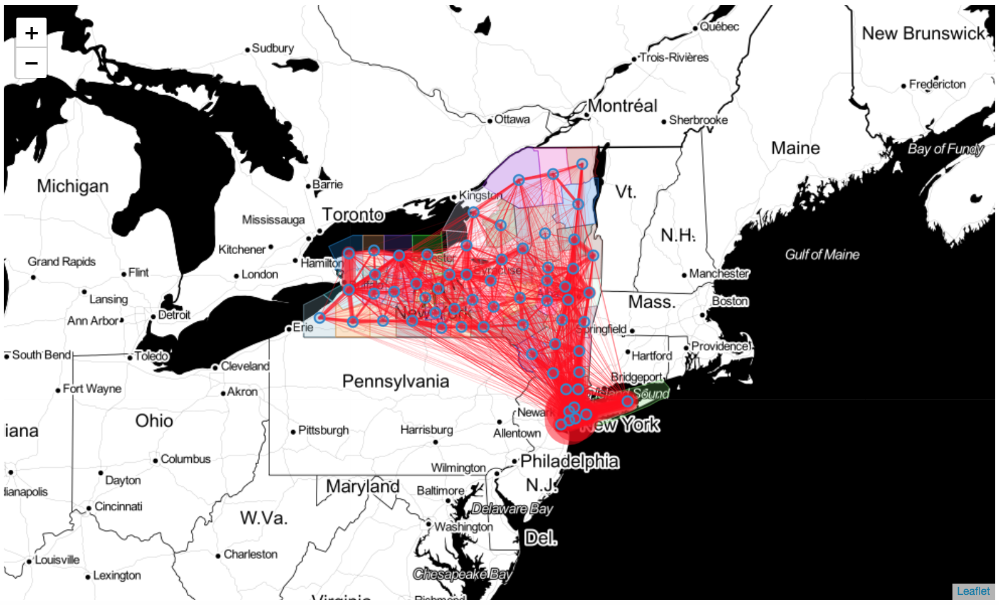
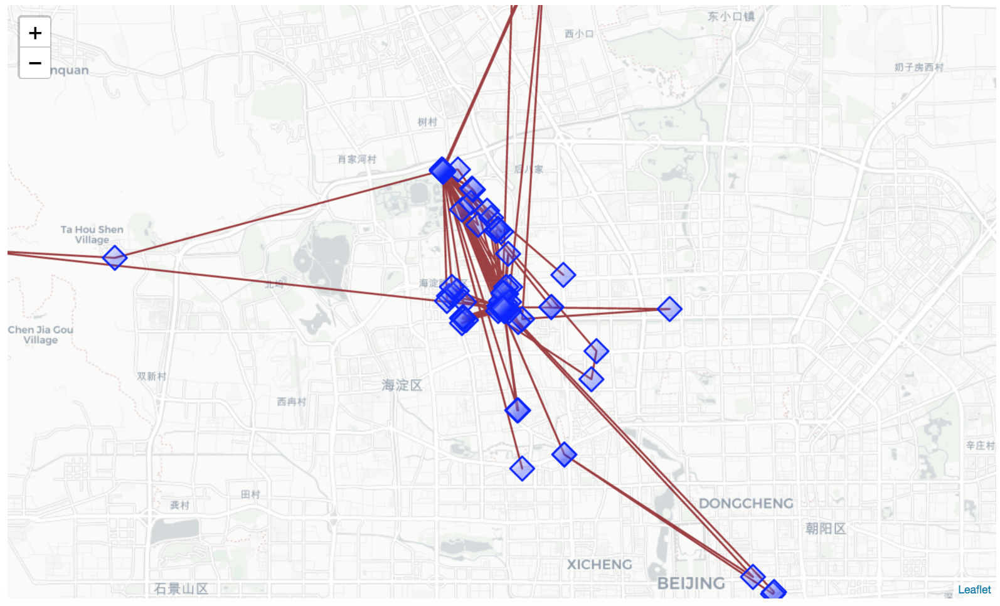
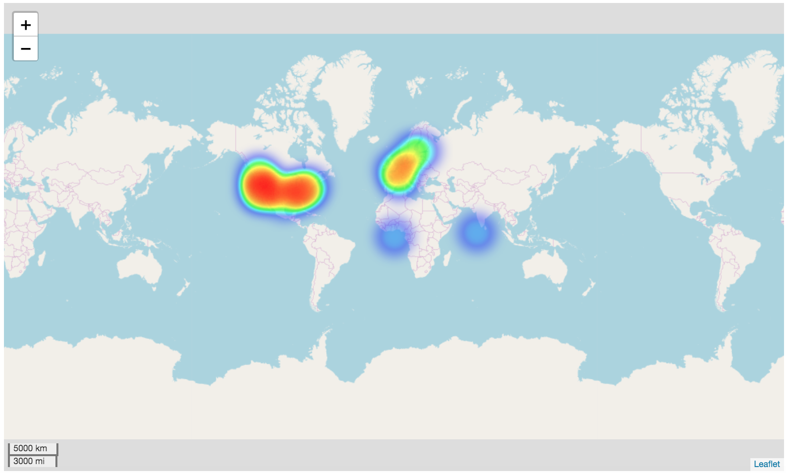
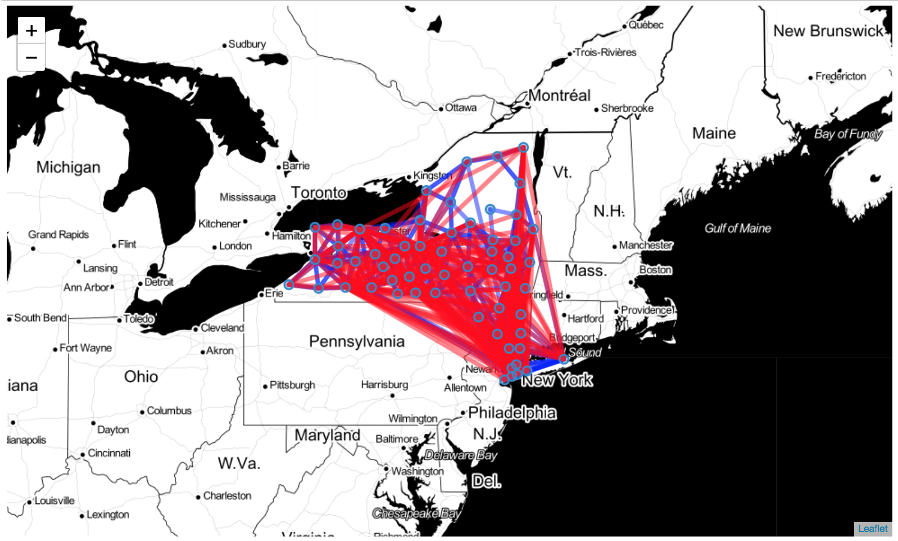

[](https://zenodo.org/badge/latestdoi/184337448)


# scikit-mobility - mobility analysis in Python


###### Try `scikit-mobility` without installing it
[](https://twitter.com/scikitmobility)

- in a MyBinder notebook: [](https://mybinder.org/v2/gh/scikit-mobility/scikit-mobility/master)
- on [Jovian](https://jovian.ai/jonpappalord/collections/scikit-mobility-tutorial)


`scikit-mobility` is a library for human mobility analysis in Python. The library allows to:

- represent trajectories and mobility flows with proper data structures, `TrajDataFrame` and `FlowDataFrame`.

- manage and manipulate mobility data of various formats (call detail records, GPS data, data from social media, survey data, etc.);

- extract mobility metrics and patterns from data, both at individual and collective level (e.g., length of displacements, characteristic distance, origin-destination matrix, etc.)

- generate synthetic individual trajectories using standard mathematical models (random walk models, exploration and preferential return model, etc.)

- generate synthetic mobility flows using standard migration models (gravity model, radiation model, etc.)

- assess the privacy risk associated with a mobility data set

## Table of contents
1. [Documentation](#documentation)
2. [Citing](#citing)
3. [Collaborate with us](#collaborate)
4. [Installation](#installation)
	- [with pip](#installation_pip)
	- [with conda](#installation_conda)
	- [known issues](#known_conda)
	- [test installation](#test_installation)
	- [Google Colab](#google_colab)
5. [Tutorials](#tutorials)
6. [Examples](#examples)
	- [TrajDataFrame](#trajdataframe)
	- [FlowDataFrame](#flowdataframe)
	- [Preprocessing](#preprocessing)
	- [Measures](#measures)
	- [Collective generative models](#collective_models)
	- [Individual generative models](#individual_models)
	- [Privacy](#privacy)
	- [Downloading datasets](#data)


<a id='documentation'></a>
## Documentation
The documentation of scikit-mobility's classes and functions is available at: https://scikit-mobility.github.io/scikit-mobility/

<a id='citing'></a>
## Citing

if you use scikit-mobility please cite the following paper:

> Luca Pappalardo, Filippo Simini, Gianni Barlacchi and Roberto Pellungrini.
> **scikit-mobility: a Python library for the analysis, generation and risk assessment of mobility data**,
> 2019, https://arxiv.org/abs/1907.07062

Bibtex:
```
@misc{pappalardo2019scikitmobility,
    title={scikit-mobility: a Python library for the analysis, generation and risk assessment of mobility data},
    author={Luca Pappalardo and Filippo Simini and Gianni Barlacchi and Roberto Pellungrini},
    year={2019},
    eprint={1907.07062},
    archivePrefix={arXiv},
    primaryClass={physics.soc-ph}
}
```

<a id='collaborate'></a>
## Collaborate with us
`scikit-mobility` is an active project and any contribution is welcome.

If you would like to include your algorithm in `scikit-mobility`, feel free to fork the project, open an issue and [contact us](mailto:scikit.mobility@gmail.com).


<a id='installation'></a>
## Installation
scikit-mobility for Python >= 3.8 and all it's dependencies are available from conda-forge and can be installed using
`conda install -c conda-forge scikit-mobility`.

Note that it is **NOT recommended** to install scikit-mobility from PyPI! If you're on Windows or Mac, many GeoPandas / scikit-mobility dependencies cannot be pip installed (for details see the corresponding notes in the GeoPandas documentation).

<a id='installation_pip'></a>
### installation with pip (python >= 3.8 required)

1. Create an environment `skmob`

        python3 -m venv skmob

2. Activate

        source skmob/bin/activate

3. Install skmob

        pip install scikit-mobility

4. OPTIONAL to use `scikit-mobility` on the jupyter notebook

	- Activate the virutalenv:

			source skmob/bin/activate

	- Install jupyter notebook:

			pip install jupyter

	- Run jupyter notebook

			jupyter notebook

	- (Optional) install the kernel with a specific name

			ipython kernel install --user --name=skmob


<a id='installation_conda'></a>
### installation with conda - miniconda

1. Create an environment `skmob` and install pip

        conda create -n skmob pip python=3.9 rtree

2. Activate

        conda activate skmob

3. Install skmob

        conda install -c conda-forge scikit-mobility

4. OPTIONAL to use `scikit-mobility` on the jupyter notebook

    - Install the kernel

          conda install jupyter -c conda-forge

    - Open a notebook and check if the kernel `skmob` is on the kernel list. If not, run the following:
    	- On Mac and Linux

          	  env=$(basename `echo $CONDA_PREFIX`)
          	  python -m ipykernel install --user --name "$env" --display-name "Python [conda env:"$env"]"

       - On Windows

             python -m ipykernel install --user --name skmob --display-name "Python [conda env: skmob]"

:exclamation: You may run into dependency issues if you try to import the package in Python. If so, try installing the following packages as followed.

```
conda install -n skmob pyproj urllib3 chardet markupsafe
```

<a id='test_installation'></a>
### Test the installation

```
> source activate skmob
(skmob)> python
>>> import skmob
>>>
```

<a id='google_colab'></a>
## Google Colab
scikit-mobility can be installed on <a href="https://colab.research.google.com/notebooks/intro.ipynb#recent=true">Google Colab</a> using the following commands:
```
!apt-get install -qq curl g++ make
!curl -L http://download.osgeo.org/libspatialindex/spatialindex-src-1.8.5.tar.gz | tar xz
import os
os.chdir('spatialindex-src-1.8.5')
!./configure
!make
!make install
!pip install rtree
!ldconfig
!pip install scikit-mobility
```

<a id='tutorials'></a>
## Tutorials
You can some tutorials on scikit-mobility here: https://github.com/scikit-mobility/tutorials.

<a id='examples'></a>
## Examples

<a id='trajdataframe'></a>
### Create a `TrajDataFrame`

In scikit-mobility, a set of trajectories is described by a `TrajDataFrame`, an extension of the pandas `DataFrame` that has specific columns names and data types. A `TrajDataFrame` can contain many trajectories, and each row in the `TrajDataFrame` represents a point of a trajectory, described by three mandatory fields (aka columns):
- `latitude` (type: float);
- `longitude` (type: float);
- `datetime` (type: date-time).

Additionally, two optional columns can be specified:
- `uid` (type: string) identifies the object associated with the point of the trajectory. If `uid` is not present, scikit-mobility assumes that the `TrajDataFrame` contains trajectories associated with a single moving object;
- `tid` specifies the identifier of the trajectory to which the point belongs to. If `tid` is not present, scikit-mobility assumes that all rows in the `TrajDataFrame` associated with a `uid` belong to the same trajectory;

Note that, besides the mandatory columns, the user can add to a `TrajDataFrame` as many columns as they want since the data structures in scikit-mobility inherit all the pandas `DataFrame` functionalities.

Create a `TrajDataFrame` from a list:

```python
>>> import skmob
>>> # create a TrajDataFrame from a list
>>> data_list = [[1, 39.984094, 116.319236, '2008-10-23 13:53:05'], [1, 39.984198, 116.319322, '2008-10-23 13:53:06'], [1, 39.984224, 116.319402, '2008-10-23 13:53:11'], [1, 39.984211, 116.319389, '2008-10-23 13:53:16']]
>>> tdf = skmob.TrajDataFrame(data_list, latitude=1, longitude=2, datetime=3)
>>> # print a portion of the TrajDataFrame
>>> print(tdf.head())
```
	   0        lat         lng            datetime
	0  1  39.984094  116.319236 2008-10-23 13:53:05
	1  1  39.984198  116.319322 2008-10-23 13:53:06
	2  1  39.984224  116.319402 2008-10-23 13:53:11
	3  1  39.984211  116.319389 2008-10-23 13:53:16
```python
>>> print(type(tdf))
```
	<class 'skmob.core.trajectorydataframe.TrajDataFrame'>

Create a `TrajDataFrame` from a [pandas](https://pandas.pydata.org/) `DataFrame`:

```python
>>> import pandas as pd
>>> # create a DataFrame from the previous list
>>> data_df = pd.DataFrame(data_list, columns=['user', 'latitude', 'lng', 'hour'])
>>> # print the type of the object
>>> print(type(data_df))
```
	<class 'pandas.core.frame.DataFrame'>
```python
>>> # now create a TrajDataFrame from the pandas DataFrame
>>> tdf = skmob.TrajDataFrame(data_df, latitude='latitude', datetime='hour', user_id='user')
>>> # print the type of the object
>>> print(type(tdf))
```
	<class 'skmob.core.trajectorydataframe.TrajDataFrame'>
```python
>>> # print a portion of the TrajDataFrame
>>> print(tdf.head())
```
	   uid        lat         lng            datetime
	0    1  39.984094  116.319236 2008-10-23 13:53:05
	1    1  39.984198  116.319322 2008-10-23 13:53:06
	2    1  39.984224  116.319402 2008-10-23 13:53:11
	3    1  39.984211  116.319389 2008-10-23 13:53:16

We can also create a `TrajDataFrame` from a file. For example, in the following we create a `TrajDataFrame` from a portion of a GPS trajectory dataset collected in the context of the [GeoLife](https://www.microsoft.com/en-us/research/publication/geolife-gps-trajectory-dataset-user-guide/) project by 178 users in a period of over four years from April 2007 to October 2011.

```python
>>> # download the file from https://raw.githubusercontent.com/scikit-mobility/scikit-mobility/master/examples/geolife_sample.txt.gz
>>> # read the trajectory data (GeoLife, Beijing, China)
>>> tdf = skmob.TrajDataFrame.from_file('geolife_sample.txt.gz', latitude='lat', longitude='lon', user_id='user', datetime='datetime')
>>> # print a portion of the TrajDataFrame
>>> print(tdf.head())
```
		 lat         lng            datetime  uid
	0  39.984094  116.319236 2008-10-23 05:53:05    1
	1  39.984198  116.319322 2008-10-23 05:53:06    1
	2  39.984224  116.319402 2008-10-23 05:53:11    1
	3  39.984211  116.319389 2008-10-23 05:53:16    1
	4  39.984217  116.319422 2008-10-23 05:53:21    1

A `TrajDataFrame` can be plotted on a [folium](https://python-visualization.github.io/folium/) interactive map using the `plot_trajectory` function.

```python
>>> tdf.plot_trajectory(zoom=12, weight=3, opacity=0.9, tiles='Stamen Toner')
```



<a id='flowdataframe'></a>
### Create a `FlowDataFrame`

In scikit-mobility, an origin-destination matrix is described by the `FlowDataFrame` structure, an extension of the pandas `DataFrame` that has specific column names and data types. A row in a `FlowDataFrame` represents a flow of objects between two locations, described by three mandatory columns:
- `origin` (type: string);
- `destination` (type: string);
- `flow` (type: integer).

Again, the user can add to a `FlowDataFrame` as many columns as they want since the `FlowDataFrame` data structure inherits all the pandas `DataFrame` functionalities.

In mobility tasks, the territory is often discretized by mapping the coordinates to a spatial tessellation, i.e., a covering of the bi-dimensional space using a countable number of geometric shapes (e.g., squares, hexagons), called tiles, with no overlaps and no gaps. For instance, for the analysis or prediction of mobility flows, a spatial tessellation is used to aggregate flows of people moving among locations (the tiles of the tessellation). For this reason, each `FlowDataFrame` is associated with a **spatial tessellation**, a [geopandas](http://geopandas.org/) `GeoDataFrame` that contains two mandatory columns:
- `tile_ID` (type: integer) indicates the identifier of a location;
- `geometry` indicates the polygon (or point) that describes the geometric shape of the location on a territory (e.g., a square, a voronoi shape, the shape of a neighborhood).

Note that each location identifier in the `origin` and `destination` columns of a `FlowDataFrame` must be present in the associated spatial tessellation.

Create a spatial tessellation from a file describing counties in New York state:

```python
>>> import skmob
>>> import geopandas as gpd
>>> # load a spatial tessellation
>>> url_tess = skmob.utils.constants.NY_COUNTIES_2011
>>> tessellation = gpd.read_file(url_tess).rename(columns={'tile_id': 'tile_ID'})
>>> # print a portion of the spatial tessellation
>>> print(tessellation.head())
```
	  tile_ID  population                                           geometry
	0   36019       81716  POLYGON ((-74.006668 44.886017, -74.027389 44....
	1   36101       99145  POLYGON ((-77.099754 42.274215, -77.0996569999...
	2   36107       50872  POLYGON ((-76.25014899999999 42.296676, -76.24...
	3   36059     1346176  POLYGON ((-73.707662 40.727831, -73.700272 40....
	4   36011       79693  POLYGON ((-76.279067 42.785866, -76.2753479999...

Create a `FlowDataFrame` from a spatial tessellation and a file of real flows between counties in New York state:

```python
>>> # load real flows into a FlowDataFrame
>>> fdf = skmob.FlowDataFrame.from_file(skmob.utils.constants.NY_FLOWS_2011,
				tessellation=tessellation,
				tile_id='tile_ID',
				sep=",")
>>> # print a portion of the flows
>>> print(fdf.head())
```
	     flow origin destination
	0  121606  36001       36001
	1       5  36001       36005
	2      29  36001       36007
	3      11  36001       36017
	4      30  36001       36019

A `FlowDataFrame` can be visualized on a [folium](https://python-visualization.github.io/folium/) interactive map using the `plot_flows` function, which plots the flows on a geographic map as lines between the centroids of the tiles in the `FlowDataFrame`'s spatial tessellation:

```python
>>> fdf.plot_flows(flow_color='red')
```



Similarly, the spatial tessellation of a `FlowDataFrame` can be visualized using the `plot_tessellation` function. The argument `popup_features` (type:list, default:[`constants.TILE_ID`]) allows to enhance the plot's interactivity displaying popup windows that appear when the user clicks on a tile and includes information contained in the columns of the tessellation's `GeoDataFrame` specified in the argument’s list:

```python
>>> fdf.plot_tessellation(popup_features=['tile_ID', 'population'])
```



The spatial tessellation and the flows can be visualized together using the `map_f` argument, which specifies the folium object on which to plot:

```python
>>> m = fdf.plot_tessellation() # plot the tessellation
>>> fdf.plot_flows(flow_color='red', map_f=m) # plot the flows
```



<a id='preprocessing'></a>
### Trajectory preprocessing
As any analytical process, mobility data analysis requires data cleaning and preprocessing steps. The `preprocessing` module allows the user to perform four main preprocessing steps:
- noise filtering;
- stop detection;
- stop clustering;
- trajectory compression;

Note that, if a `TrajDataFrame` contains multiple trajectories from multiple users, the preprocessing methods automatically apply to the single trajectory and, when necessary, to the single moving object.

#### Noise filtering
In scikit-mobility, the function `filter` filters out a point if the speed from the previous point is higher than the parameter `max_speed`, which is by default set to 500km/h.

```python
>>> from skmob.preprocessing import filtering
>>> # filter out all points with a speed (in km/h) from the previous point higher than 500 km/h
>>> ftdf = filtering.filter(tdf, max_speed_kmh=500.)
>>> print(ftdf.parameters)
```
	{'from_file': 'geolife_sample.txt.gz', 'filter': {'function': 'filter', 'max_speed_kmh': 500.0, 'include_loops': False, 'speed_kmh': 5.0, 'max_loop': 6, 'ratio_max': 0.25}}
```python
>>> n_deleted_points = len(tdf) - len(ftdf) # number of deleted points
>>> print(n_deleted_points)
```
	54

Note that the `TrajDataFrame` structure as the `parameters` attribute, which indicates the operations that have been applied to the `TrajDataFrame`. This attribute is a dictionary the key of which is the signature of the function applied.

#### Stop detection
Some points in a trajectory can represent Point-Of-Interests (POIs) such as schools, restaurants, and bars, or they can represent user-specific places such as home and work locations. These points are usually called Stay Points or Stops, and they can be detected in different ways. A common approach is to apply spatial clustering algorithms to cluster trajectory points by looking at their spatial proximity. In scikit-mobility, the `stay_locations` function, contained in the `detection` module, finds the stay points visited by a moving object. For instance, to identify the stops where the object spent at least `minutes_for_a_stop` minutes within a distance `spatial_radius_km \time stop_radius_factor`, from a given point, we can use the following code:

```python
>>> from skmob.preprocessing import detection
>>> # compute the stops for each individual in the TrajDataFrame
>>> stdf = detection.stay_locations(tdf, stop_radius_factor=0.5, minutes_for_a_stop=20.0, spatial_radius_km=0.2, leaving_time=True)
>>> # print a portion of the detected stops
>>> print(stdf.head())
```
		 lat         lng            datetime  uid    leaving_datetime
	0  39.978030  116.327481 2008-10-23 06:01:37    1 2008-10-23 10:32:53
	1  40.013820  116.306532 2008-10-23 11:10:19    1 2008-10-23 23:45:27
	2  39.978419  116.326870 2008-10-24 00:21:52    1 2008-10-24 01:47:30
	3  39.981166  116.308475 2008-10-24 02:02:31    1 2008-10-24 02:30:29
	4  39.981431  116.309902 2008-10-24 02:30:29    1 2008-10-24 03:16:35
```python
>>> print('Points of the original trajectory:\t%s'%len(tdf))
>>> print('Points of stops:\t\t\t%s'%len(stdf))
```
	Points of the original trajectory:	217653
	Points of stops:			391

A new column `leaving_datetime` is added to the `TrajDataFrame` in order to indicate the time when the user left the stop location. We can then visualize the detected stops using the `plot_stops` function:

```python
>>> m = stdf.plot_trajectory(max_users=1, start_end_markers=False)
>>> stdf.plot_stops(max_users=1, map_f=m)
```



#### Trajectory compression
The goal of trajectory compression is to reduce the number of trajectory points while preserving the structure of the trajectory. This step results in a significant reduction of the number of trajectory points. In scikit-mobility, we can use one of the methods in the `compression` module under the `preprocessing` module. For instance, to merge all the points that are closer than 0.2km from each other, we can use the following code:

```python
>>> from skmob.preprocessing import compression
>>> # compress the trajectory using a spatial radius of 0.2 km
>>> ctdf = compression.compress(tdf, spatial_radius_km=0.2)
>>> # print the difference in points between original and filtered TrajDataFrame
>>> print('Points of the original trajectory:\t%s'%len(tdf))
>>> print('Points of the compressed trajectory:\t%s'%len(ctdf))
```
	Points of the original trajectory:	217653
	Points of the compressed trajectory:	6281

<a id='measures'></a>
### Mobility measures
Several measures have been proposed in the literature to capture the patterns of human mobility, both at the individual and collective levels. Individual measures summarize the mobility patterns of a single moving object, while collective measures summarize mobility patterns of a population as a whole. scikit-mobility provides a wide set of [mobility measures](https://scikit-mobility.github.io/scikit-mobility/reference/measures.html), each implemented as a function that takes in input a `TrajDataFrame` and outputs a pandas `DataFrame`. Individual and collective measures are implemented the in `skmob.measure.individual` and the `skmob.measures.collective` modules, respectively.

For example, the following code compute the *radius of gyration*, the *jump lengths* and the *home locations* of a `TrajDataFrame`:

```python
>>> from skmob.measures.individual import jump_lengths, radius_of_gyration, home_location
>>> # load a TrajDataFrame from an URL
>>> url = "https://snap.stanford.edu/data/loc-brightkite_totalCheckins.txt.gz"
>>> df = pd.read_csv(url, sep='\t', header=0, nrows=100000,
     names=['user', 'check-in_time', 'latitude', 'longitude', 'location id'])
>>> tdf = skmob.TrajDataFrame(df, latitude='latitude', longitude='longitude', datetime='check-in_time', user_id='user')
>>> # compute the radius of gyration for each individual
>>> rg_df = radius_of_gyration(tdf)
>>> print(rg_df)
```
	   uid  radius_of_gyration
	0    0         1564.436792
	1    1         2467.773523
	2    2         1439.649774
	3    3         1752.604191
	4    4         5380.503250
```python
>>> # compute the jump lengths for each individual
>>> jl_df = jump_lengths(tdf.sort_values(by='datetime'))
>>> print(jl_df.head())
```
	   uid                                       jump_lengths
	0    0  [19.640467328877936, 0.0, 0.0, 1.7434311010381...
	1    1  [6.505330424378251, 46.75436600375988, 53.9284...
	2    2  [0.0, 0.0, 0.0, 0.0, 3.6410097195943507, 0.0, ...
	3    3  [3861.2706300798827, 4.061631313492122, 5.9163...
	4    4  [15511.92758595804, 0.0, 15511.92758595804, 1....

Note that for some measures, such as `jump_length`, the `TrajDataFrame` must be order in increasing order by the column `datetime` (see the documentation for the measures that requires this condition https://scikit-mobility.github.io/scikit-mobility/reference/measures.html).

```python
>>> # compute the home location for each individual
>>> hl_df = home_location(tdf)
>>> print(hl_df.head())
```
	   uid        lat         lng
	0    0  39.891077 -105.068532
	1    1  37.630490 -122.411084
	2    2  39.739154 -104.984703
	3    3  37.748170 -122.459192
	4    4  60.180171   24.949728
```python
>>> # now let's visualize a cloropleth map of the home locations
>>> import folium
>>> from folium.plugins import HeatMap
>>> m = folium.Map(tiles = 'openstreetmap', zoom_start=12, control_scale=True)
>>> HeatMap(hl_df[['lat', 'lng']].values).add_to(m)
>>> m
```



<a id='collective_models'></a>
### Collective generative models
Collective generative models estimate spatial flows between a set of discrete locations. Examples of spatial flows estimated with collective generative models include commuting trips between neighborhoods, migration flows between municipalities, freight shipments between states, and phone calls between regions.

In scikit-mobility, a collective generative model takes in input a spatial tessellation, i.e., a geopandas `GeoDataFrame`. To be a valid input for a collective model, the spatial tessellation should contain two columns, `geometry` and `relevance`, which are necessary to compute the two variables used by collective algorithms: the distance between tiles and the importance (aka "attractiveness") of each tile. A collective algorithm produces a `FlowDataFrame` that contains the generated flows and the spatial tessellation. scikit-mobility implements the most common collective generative algorithms:
- the `Gravity` model;
- the `Radiation` model.

#### Gravity model
The class `Gravity`, implementing the Gravity model, has two main methods:
- `fit`, which calibrates the model's parameters using a `FlowDataFrame`;
- `generate`, which generates the flows on a given spatial tessellation.

Load the spatial tessellation and a data set of real flows in a `FlowDataFrame`:

```python
>>> from skmob.utils import utils, constants
>>> import geopandas as gpd
>>> from skmob.models.gravity import Gravity
>>> import numpy as np
>>> # load a spatial tessellation
>>> url_tess = skmob.utils.constants.NY_COUNTIES_2011
>>> tessellation = gpd.read_file(url_tess).rename(columns={'tile_id': 'tile_ID'})
>>> # load the file with the real fluxes
>>> fdf = skmob.FlowDataFrame.from_file(skmob.utils.constants.NY_FLOWS_2011,
					tessellation=tessellation,
					tile_id='tile_ID',
					sep=",")
>>> # compute the total outflows from each location of the tessellation (excluding self loops)
>>> tot_outflows = fdf[fdf['origin'] != fdf['destination']].groupby(by='origin', axis=0)[['flow']].sum().fillna(0)
>>> tessellation = tessellation.merge(tot_outflows, left_on='tile_ID', right_on='origin').rename(columns={'flow': 'tot_outflow'})
```

Instantiate a Gravity model object and generate synthetic flows:

```python
>>> # instantiate a singly constrained Gravity model
>>> gravity_singly = Gravity(gravity_type='singly cons/tetrained')
>>> print(gravity_singly)
```
	Gravity(name="Gravity model", deterrence_func_type="power_law", deterrence_func_args=[-2.0], origin_exp=1.0, destination_exp=1.0, gravity_type="singly constrained")
```python
>>> # start the generation of the synthetic flows
>>> np.random.seed(0)
>>> synth_fdf = gravity_singly.generate(tessellation,
				   tile_id_column='tile_ID',
				   tot_outflows_column='tot_outflow',
				   relevance_column= 'population',
				   out_format='flows')
>>> # print a portion of the synthetic flows
>>> print(synth_fdf.head())
```
	  origin destination  flow
	0  36019       36101   101
	1  36019       36107    66
	2  36019       36059  1041
	3  36019       36011   151
	4  36019       36123    33

Fit the parameters of the Gravity model from the `FlowDataFrame` and generate the synthetic flows:

```python
>>> # instantiate a Gravity object (with default parameters)
>>> gravity_singly_fitted = Gravity(gravity_type='singly constrained')
>>> print(gravity_singly_fitted)
```
	Gravity(name="Gravity model", deterrence_func_type="power_law", deterrence_func_args=[-2.0], origin_exp=1.0, destination_exp=1.0, gravity_type="singly constrained")
```python
>>> # fit the parameters of the Gravity from the FlowDataFrame
>>> gravity_singly_fitted.fit(fdf, relevance_column='population')
>>> print(gravity_singly_fitted)
```
	Gravity(name="Gravity model", deterrence_func_type="power_law", deterrence_func_args=[-1.9947152031914186], origin_exp=1.0, destination_exp=0.6471759552223144, gravity_type="singly constrained")
```python
>>> # generate the synthetics flows
>>> np.random.seed(0)
>>> synth_fdf_fitted = gravity_singly_fitted.generate(tessellation,
							tile_id_column='tile_ID',
							tot_outflows_column='tot_outflow',
							relevance_column= 'population',
							out_format='flows')
>>> # print a portion of the synthetic flows
>>> print(synth_fdf_fitted.head())
```
	  origin destination  flow
	0  36019       36101   102
	1  36019       36107    66
	2  36019       36059  1044
	3  36019       36011   152
	4  36019       36123    33

Plot the real flows and the synthetic flows:

```python
>>> m = fdf.plot_flows(min_flow=100, flow_exp=0.01, flow_color='blue')
>>> synth_fdf_fitted.plot_flows(min_flow=1000, flow_exp=0.01, map_f=m)
```



#### Radiation model
The Radiation model is parameter-free and has only one method: `generate`. Given a spatial tessellation, the synthetic flows can be generated using the `Radiation` class as follows:

```python
>>> from skmob.models.radiation import Radiation
>>> # instantiate a Radiation object
>>> radiation = Radiation()
>>> # start the simulation
>>> np.random.seed(0)
>>> rad_flows = radiation.generate(tessellation,
				tile_id_column='tile_ID',
				tot_outflows_column='tot_outflow',
				relevance_column='population',
				out_format='flows_sample')
>>> # print a portion of the synthetic flows
>>> print(rad_flows.head())
```
	  origin destination   flow
	0  36019       36033  11648
	1  36019       36031   4232
	2  36019       36089   5598
	3  36019       36113   1596
	4  36019       36041    117

<a id='individual_models'></a>
### Individual generative models
The goal of individual generative models of human mobility is to create a population of agents whose mobility patterns are statistically indistinguishable from those of real individuals. An individual generative model typically generates a synthetic trajectory corresponding to a single moving object, assuming that an object is independent of the others.

scikit-mobility implements the most common individual generative models, such as the [Exploration and Preferential Return](https://www.nature.com/articles/nphys1760) model and its variants, and [DITRAS](https://link.springer.com/article/10.1007/s10618-017-0548-4). Each generative model is a python class with a public method `generate`, which starts the generation of synthetic trajectories.

The following code generate synthetic trajectories using the `DensityEPR` model:

```python
>>> from skmob.models.epr import DensityEPR
>>> # load a spatial tesellation on which to perform the simulation
>>> url = skmob.utils.constants.NY_COUNTIES_2011
>>> tessellation = gpd.read_file(url)
>>> # starting and end times of the simulation
>>> start_time = pd.to_datetime('2019/01/01 08:00:00')
>>> end_time = pd.to_datetime('2019/01/14 08:00:00')
>>> # instantiate a DensityEPR object
>>> depr = DensityEPR()
>>> # start the simulation
>>> tdf = depr.generate(start_time, end_time, tessellation, relevance_column='population', n_agents=100)
>>> print(tdf.head())
```
	   uid                   datetime        lat        lng
	0    1 2019-01-01 08:00:00.000000  42.452018 -76.473618
	1    1 2019-01-01 08:32:30.108708  42.170344 -76.306260
	2    1 2019-01-01 09:09:11.760703  43.241550 -75.435903
	3    1 2019-01-01 10:00:22.832309  42.170344 -76.306260
	4    1 2019-01-01 14:00:25.923314  42.267915 -77.383591
```python
>>> print(tdf.parameters)
```
	{'model': {'class': <function DensityEPR.__init__ at 0x7f70ce0a7e18>, 'generate': {'start_date': Timestamp('2019-01-01 08:00:00'), 'end_date': Timestamp('2019-01-14 08:00:00'), 'gravity_singly': {}, 'n_agents': 100, 'relevance_column': 'population', 'random_state': None, 'verbose': True}}}

<a id='privacy'></a>
### Privacy
Mobility data is sensitive since the movements of individuals can reveal confidential personal information or allow the re-identification of individuals in a database, creating serious privacy risks. In the literature, privacy risk assessment relies on the concept of re-identification of a moving object in a database through an attack by a malicious adversary. A common framework for privacy risk assessment assumes that during the attack a malicious adversary acquires, in some way, the access to an anonymized mobility data set, i.e., a mobility data set in which the moving object associated with a trajectory is not known. Moreover, it is assumed that the malicious adversary acquires, in some way, information about the trajectory (or a portion of it) of an individual represented in the acquired data set. Based on this information, the risk of re-identification of that individual is computed estimating how unique that individual's mobility data are with respect to the mobility data of the other individuals represented inthe acquired data set.

scikit-mobility provides several attack models, each implemented as a python class. For example in a location attack model, implemented in the `LocationAttack` class, the malicious adversary knows a certain number of locations visited by an individual, but they do not know the temporal order of the visits. To instantiate a `LocationAttack` object we can run the following code:

```python
>>> import skmob
>>> from skmob.privacy import attacks
>>> at = attacks.LocationAttack(knowledge_length=2)
```

The argument `knowledge_length` specifies how many locations the malicious adversary knows of each object's movement. The re-identification risk is computed based on the worst possible combination of `knowledge_length` locations out of all possible combinations of locations.

To assess the re-identification risk associated with a mobility data set, represented as a `TrajDataFrame`, we specify it as input to the `assess_risk` method, which returns a pandas `DataFrame` that contains the `uid` of each object in the `TrajDataFrame` and the associated re-identification risk as the column `risk` (type: float, range: $[0,1]$  where 0 indicates minimum risk and 1 maximum risk).

```python
>>> tdf = skmob.TrajDataFrame.from_file(filename="privacy_toy.csv")
>>> tdf_risk = at.assess_risk(tdf)
>>> print(tdf_risk.head())
```
	   uid      risk
	0    1  0.333333
	1    2  0.500000
	2    3  0.333333
	3    4  0.333333
	4    5  0.250000

Since risk assessment may be time-consuming for more massive datasets, scikit-mobility provides the option to focus only on a subset of the objects with the argument `targets`. For example, in the following code, we compute the re-identification risk for the object with `uid` 1 and 2 only:

```python
>>> tdf_risk = at.assess_risk(tdf, targets=[1,2])
>>> print(tdf_risk)
```
	   uid      risk
	0    1  0.333333
	1    2  0.500000


<a id="data"></a>
### Downloading datasets

The `data` module of scikit-mobility provides users with an easy way to: 1) Download ready-to-use mobility data (e.g., trajectories, flows, spatial tessellations, and auxiliary data); 2) Load and transform the downloaded dataset into standard skmob structures (TrajDataFrame, GeoDataFrame, FlowDataFrame, DataFrame); 3) Allow developers and contributors to add new datasets to the library.

The `data` module provides three functions:
 - `list_datasets`
 - `get_dataset_info`
 - `load_dataset`


The user can download the list of all datasets currently available in the library using `list_datasets`:

```python
>>> import skmob
>>> from skmob.data.load import list_datasets

>>> list_datasets()
```
	['flow_foursquare_nyc',
	 'foursquare_nyc',
	 'nyc_boundaries',
	 'parking_san_francisco',
	 'taxi_san_francisco']


The user can retrieve information about a specific dataset in the library using `get_dataset_info`:

```python
>>> import skmob
>>> from skmob.data.load import get_dataset_info

>>> get_dataset_info("foursquare_nyc")
```

	{'name': 'Foursquare_NYC',
	 'description': 'Dataset containing the Foursquare checkins of individuals moving in New York City',
	 'url': 'http://www-public.it-sudparis.eu/~zhang_da/pub/dataset_tsmc2014.zip',
	 'hash': 'cbe3fdab373d24b09b5fc53509c8958c77ff72b6c1a68589ce337d4f9a80235b',
	 'auth': 'no',
	 'data_type': 'trajectory',
	 'download_format': 'zip',
	 'sep': '   ',
	 'encoding': 'ISO-8859-1'}


Finally, the user can download a specific dataset using `load_dataset`:

```python
>>> import skmob
>>> from skmob.data.load import load_dataset, list_datasets

>>> tdf_nyc = load_dataset("foursquare_nyc", drop_columns=True)
>>> print(tdf_nyc.head())
```
	   uid        lat        lng                  datetime
	0  470  40.719810 -74.002581 2012-04-03 18:00:09+00:00
	1  979  40.606800 -74.044170 2012-04-03 18:00:25+00:00
	2   69  40.716162 -73.883070 2012-04-03 18:02:24+00:00
	3  395  40.745164 -73.982519 2012-04-03 18:02:41+00:00
	4   87  40.740104 -73.989658 2012-04-03 18:03:00+00:00


# Related packages
[*movingpandas*](https://github.com/anitagraser/movingpandas) is a similar package that deals with movement data. Instead of implementing new data structures tailored for trajectories (`TrajDataFrame`) and mobility flows (`FlowDataFrame`), *movingpandas* describes a trajectory using a *geopandas* `GeoDataFrame`. There is little overlap in the covered use cases and implemented functionality (comparing [*scikit-mobility* tutorials](https://github.com/scikit-mobility/tutorials) and [*movingpandas* tutorials](https://github.com/anitagraser/movingpandas/tree/master/tutorials)): *scikit-mobility* focuses on computing human mobility metrics, generating synthetic trajectories and assessing privacy risks of mobility datasets. *movingpandas* on the other hand focuses on spatio-temporal data exploration with corresponding functions for data manipulation and analysis.
